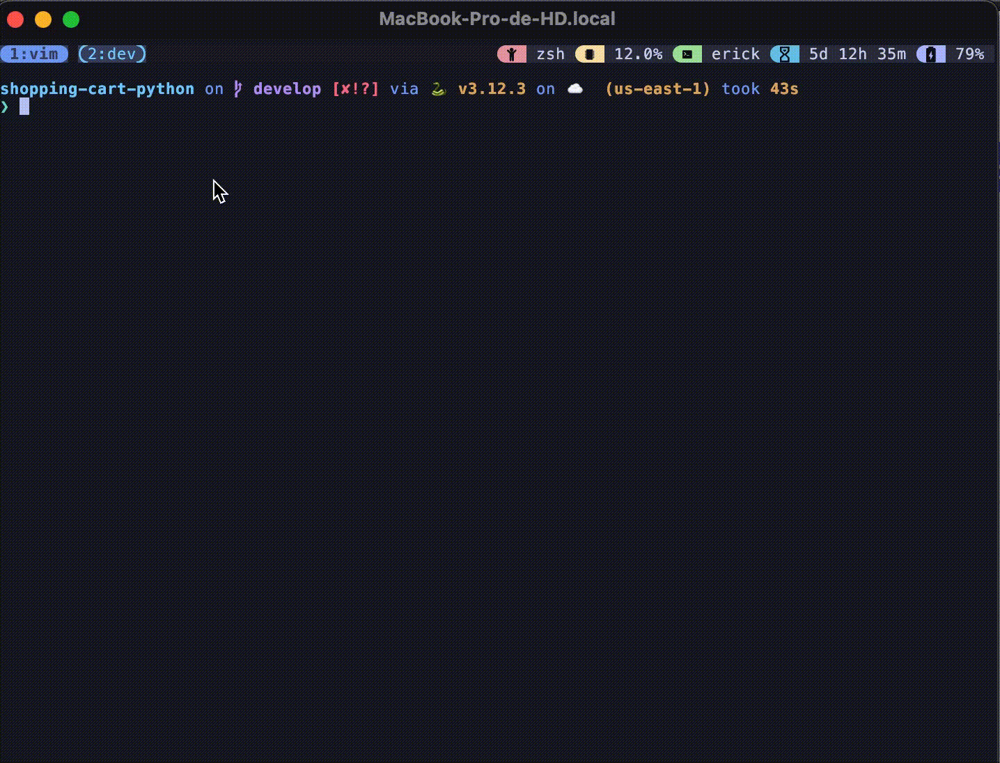

# 🛒 Final Project: Shopping Cart Simulator

This project simulates the logic of a basic e-commerce project, but with enough complexity to help you think about modularization, input validation, error handling, and clean, pure-function design. There's no graphical interface or API consumption: you work with the console and data structures.

<div style="text-align: center">

</div>

## 🚀 How to Run the Project

### 1. Clone the repository

```bash
git clone https://github.com/aireck2/shopping-cart-python.git
```

### 2. (Optional) Create and activate a virtual environment

```bash
# Create a virtual environment
python -m venv venv

# Activate it
source venv/bin/activate
```

### 4. Run the application

Simply run:

```bash
python main.py
```

## 💻 Features

- View product list: View the list of available products with their names, codes, and prices.

- Add products to the cart: The user can select products and add them to their cart.

- Remove products from the cart: The user can select products and remove them from the cart.

- Clean cart: Clear the cart completely.

- View cart: View the cart contents and the total purchase amount.

- Complete purchase: The user can finalize the purchase. The purchase is registered in a CSV file.

- Exit: Exit the program.

## 🧩 Customization

- Add products: You can modify the file data/products_data.json to add or remove products.

## 📄 Requirements

- Python 3.7 or higher.

## 👨‍💻 Author

- [Erick Escriba | @Aireck2](https://github.com/Aireck2)

This is an educational project created as part of a final assignment.
